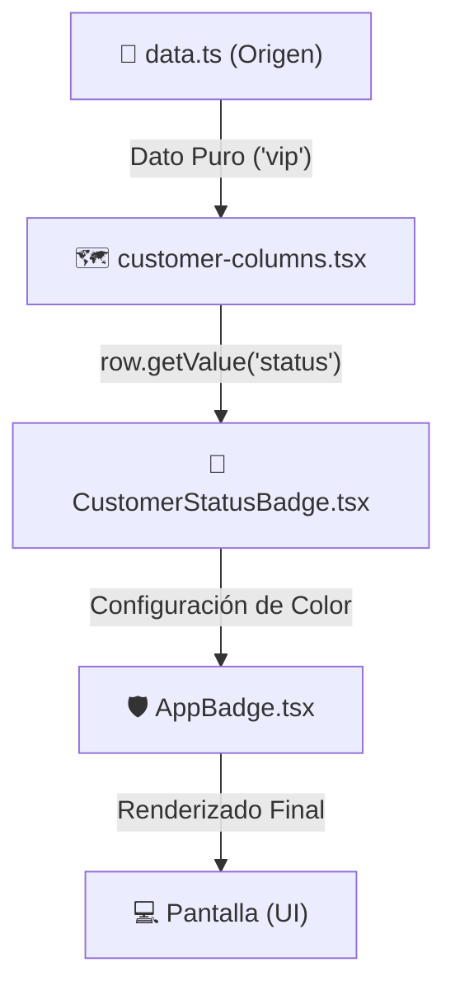

# Explicación del Sistema de Badges y Flujo de Datos

Este documento explica cómo funciona el sistema de etiquetas (badges) en la tabla de clientes, desde el origen de los datos hasta su representación visual en la pantalla.

## El Flujo de Datos

El viaje de un dato (como el estado de un cliente) sigue una cadena de responsabilidades clara:



---

## 1. El Origen: `data.ts`
Es donde reside la "verdad". Aquí los datos son simples objetos de JavaScript.
*   **Dato:** El estado es un simple string como `"active"`, `"pending"` o `"vip"`.
*   **Propósito:** Almacenamiento puro sin conocimiento de estilos.

## 2. El Conector: `customer-columns.tsx`
Utilizamos **TanStack Table** para mapear los datos a la estructura de la tabla.

*   **`accessorKey`**: Es el "mapeador". Le dice a la tabla: *"Para esta columna, buscá el campo llamado 'status' en el objeto del cliente"*.
*   **`row.getValue("status")`**: Es la función que extrae el valor real de la fila actual. Si la tabla está dibujando la fila de 'Alice', esta función devolverá su estado específico.
*   **Consumo**: Pasamos ese valor extraído como un *prop* a nuestro componente especializado.

```tsx
cell: ({ row }) => <CustomerStatusBadge status={row.getValue("status")} />
```

## 3. El Cerebro: `CustomerStatusBadge.tsx`
Este componente actúa como un **Traductor de Negocio a Diseño**. Su única tarea es recibir un texto y decidir cómo debe verse.

1.  **Mapa de Configuración**: Tiene un objeto (`statusConfig`) donde asociamos cada estado con un color y una etiqueta.
2.  **Lógica**: Si recibe `"vip"`, busca en el mapa y obtiene:
    *   **Etiqueta**: `"VIP"`
    *   **Clases CSS**: `bg-violet-500/15 text-violet-700...`

## 4. La Base Visual: `AppBadge.tsx`
Es nuestro componente base "personalizable". 
*   Recibe las clases de Tailwind que decidió el "Cerebro".
*   Inyecta esas clases en el componente `Badge` de Shadcn para darle la forma final.

---

## Resumen de Conceptos Clave

| Concepto | Función Práctica |
| :--- | :--- |
| **`accessorKey`** | El nombre de la columna en tus datos (ej: `"status"`). |
| **`row.getValue`** | Saca el valor real de la base de datos para la fila actual. |
| **`statusConfig`** | Centraliza todos los colores y nombres en un solo lugar. |
| **`AppBadge`** | Componente reutilizable que permite colores dinámicos. |

**Beneficio Principal:** Este sistema es **escalable**. Si mañana agregás un estado nuevo como `"gold_member"`, solo tenés que añadirlo al mapa de colores en un solo archivo, y aparecerá correctamente en toda la app.
